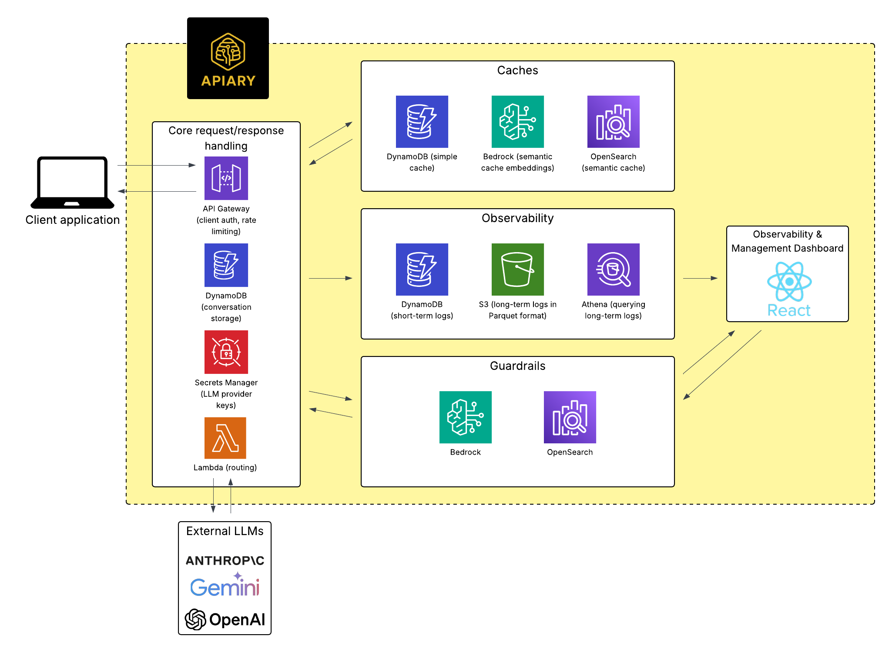

# Installing Apiary with the Apiary CLI

## Introduction

Apiary is a large language model (LLM) gateway for handling requests to multiple
LLM providers with a unified API. It provides built-in observability, cost tracking, 
fallbacks, request routing, simple and semantic caching, and output guardrails.

The Apiary CLI tool facilitates easy deployment of its AWS infrastructure.
Once deployed, you can start making LLM requests using the [Apiary SDK](https://github.com/Apiary-gateway/clientSDK).

* [Infrastructure Overview](#infrastructure-overview)
* [Getting Started](#getting-started)
* [Commands](#commands)

## Infrastructure Overview

Apiary deploys and provisions the following key components in your AWS account:
<p align="center">
  
</p>

## Getting Started

### Prerequisites

To get started with Apiary, ensure that you have the following set up:
- An active [AWS account](https://aws.amazon.com/account/) with a user or role that has the `AdministratorAccess` policy attached. This user or role must be configured for use with the AWS CLI.
- AWS CLI is [installed](https://docs.aws.amazon.com/cli/latest/userguide/getting-started-install.html) and configured
- AWS CDK is [installed](https://docs.aws.amazon.com/cdk/v2/guide/getting_started.html)
- AWS Bedrock is configured in your account to allow access to the **Titan Text Embeddings V2 model**
  - Bedrock access must be configured through the [Bedrock console](https://console.aws.amazon.com/bedrock/). Follow [these steps](https://docs.aws.amazon.com/bedrock/latest/userguide/model-access-modify.html) to grant access to the Titan Text Embeddings V2 model.
- [Node.js](https://nodejs.org/en/download) and [npm](https://docs.npmjs.com/cli/v10/commands/npm-install) are installed

### Installation

To install the Apiary CLI tool, run the following command:
```bash
npm install -g @apiary-gateway/cli
```

To verify that the installation was successful, run:
```bash
apiary --version
```
This will output the installed version number.

To view a list of available commands, run:
```bash
apiary --help
```

### First Time Usage

Running `apiary create` will clone the Apiary CDK infrastructure into a new `apiary` folder inside your current working directory. Make sure you're in the directory where you want the `apiary` folder to be created before running the command.

Upon running `apiary create`, you'll be prompted to provide your LLM provider API
keys as part of the deployment process. These will be securely stored using AWS 
Secrets Manager.

Once deployed, the Apiary CLI will output:
- An `AiGatewayRestApiEndpoint` URL - you can start sending LLM requests to this URL using the [Apiary SDK](https://github.com/Apiary-gateway/clientSDK)
- An API key to use when sending requests to your Apiary instance. Please save this key securely for future reference
  - You can manage API keys and usage plans for your Apiary instance using the [commands](#commands) below
- A `FrontendCloudFrontUrl` URL - visit this URL to access the Observability and Management 
Dashboard. Use the dashboard to:
  - Set custom routing rules for your Apiary instance
  - Configure caching and guardrails settings
  - Monitor requests and LLM responses flowing through the system

## Commands

- [`apiary create`](#apiary-create)
- [`apiary destroy`](#apiary-destroy)
- [`apiary update-llm-api-keys`](#apiary-update-llm-api-keys)
- [`apiary delete-llm-api-keys`](#apiary-delete-llm-api-keys)
- [`apiary create-usage-plan-with-key`](#apiary-create-usage-plan-with-key)
- [`apiary get-usage-plans`](#apiary-get-usage-plans)
- [`apiary delete-usage-plan`](#apiary-delete-usage-plan)
- [`apiary edit-usage-plan`](#apiary-edit-usage-plan)
- [`apiary help [COMMAND]`](#apiary-help-[command])

### `apiary create`

Deploy Apiary infrastructure to AWS.

### `apiary destroy`

Delete all Apiary resources in your AWS account. This action is irreversible.

### `apiary update-llm-api-keys`

Update your stored API keys for LLM providers.

### `apiary delete-llm-api-keys`

Delete all of your stored API keys for LLM providers. This action is irreversible.

### `apiary create-usage-plan-with-key`

Create a new usage plan for your Apiary instance with an associated API key.

### `apiary get-usage-plans`

View all usage plans associated with your Apiary instance.

### `apiary delete-usage-plan`

Delete a specific usage plan associated with your Apiary instance. This will also delete 
the API key(s) associated with the usage plan. You'll be prompted to provide the usage plan ID.

### `apiary edit-usage-plan`

Edit a specific usage plan associated with your Apiary instance. You'll be 
prompted to provide the usage plan ID.

### `apiary help [COMMAND]`

Display usage and description for an Apiary command.
